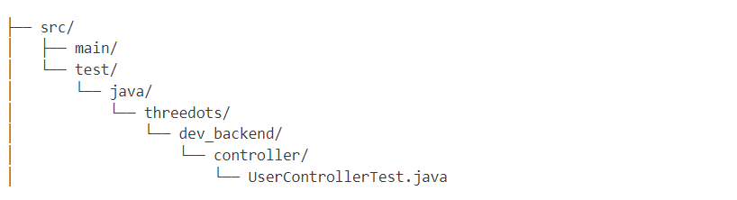

# Software Design - Group assignment

# Oma News

OmaNews is a Sentiment Analysis News Feed Application that enables users to explore and filter news articles based on sentiment (positive, neutral, or negative) and visualize trends over time.

## Application Setup / Running Instructions

1.  ### Clone the repo:

    use the following command:
    -- git clone https://course-gitlab.tuni.fi/compse110-fall2024/three-dots.git

2.  ### Backend Setup:
    1. After cloning go to terminal, and use the following command: <br>
       -- **cd dev-backend**
    2. Copy the EnvFileExample to .env and fill in the required values. .env file will be under the resources folder.
    3. Build the project :Open the terminal and use the following command: <br>
       -- **mvn clean install**
    4. You can run the backend server by clicking the run option for the DevBackendApplication file in your IDE, or by using the following command: <br>
       -- **mvn spring-boot:run**

The backend server should now be running on http://localhost:8080.

3. ### Frontend Setup:

   1. use the following command:<br>
      -- **cd dev-frontend** <br>
      -- **cd client**
   2. Copy the EnvFileExample to .env and fill in the required values. The .env file should be in the root.
   3. Install Install dependencies: Open the terminal and run this command: <br>
      -- **npm install**
   4. Run the frontend server: <br>
      -- **npm run dev**

   In case you get error with rollup package, try to run:
   -- **npm install vite@latest rollup@latest --save-dev**

   The frontend server should now be running on http://localhost:3000.

Finally, The application can be access at http://localhost:3000.

## Testing Guide

For both backend and frontend test cases has been written.

### Backend

For backend part all controller files has been tested. We use JUnit 5 as the test framework, along with Mockito for mocking dependencies. The test file structer given bellow


### Running Tests

1. Run the Test in an IDE for individual test files:
   In IntelliJ IDEA or Eclipse, right-click on the test class (example: UserControllerTest) and select Run UserControllerTest.
2. Running all test in terminal:
   Open a terminal in your project directory and run the following command:
   -- mvn test

### FrontEnd

### Test Structure

The project uses Vitest with React Testing Library for component testing. Tests are organized as follows:

```
src/
├── pages/
│   ├── Home/
│   │   ├── Home.jsx
│   │   └── Home.test.jsx

```

### Running Tests

1. **Run All Tests**

   ```bash
   npm run test
   ```

2. **Watch Mode** (for development)

   ```bash
   npm run test:watch
   ```

3. **Coverage Report**

   ```bash
   npm run test:coverage
   ```

4. **Test Summary**

   ```bash
   npm run test:summary
   ```

5. **Run Specific Test File**
   ```bash
   npm run test src/pages/Home/Home.test.jsx
   ```
